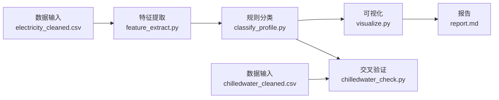

# Building Energy Profile Analysis (MVP)

<!-- FLOWCHART:START -->

<!-- FLOWCHART:END -->

Goal: calculate hourly electricity load features for each building and assign a profile using fixed, documented rules.

## Inputs

Default input directory: `~/workspace/goals/goal-4/hidden_files/data/`.

- `electricity_cleaned.csv`: timestamp rows and one column per building; used for the main feature extraction, classification, and plots.
- `chilledwater_cleaned.csv`: used for the cross-check against electricity classes for buildings present in both files.
- `metadata.csv`: building metadata; inspected to confirm building IDs, but not used in the calculations.
- `weather.csv`: present in the source directory, not used in the calculations.

The scripts read the input files only. Dependencies: Python 3, pandas, numpy, and matplotlib.

## Run order

Run from this project directory:

```bash
python3 scripts/feature_extract.py
python3 scripts/classify_profile.py
python3 scripts/visualize.py
python3 scripts/chilledwater_check.py
python3 scripts/generate_flowchart.py
```

The first three scripts also accept path overrides. For example:

```bash
python3 scripts/feature_extract.py --input /path/to/electricity_cleaned.csv --output output/features.csv
python3 scripts/classify_profile.py --input output/features.csv --output output/building_profiles.csv
python3 scripts/visualize.py --input /path/to/electricity_cleaned.csv --profiles output/building_profiles.csv --figures output/figures
```

## Scripts and outputs

- `scripts/feature_extract.py`: reads the wide electricity CSV in chunks and writes one feature row per building to `output/features.csv`.
- `scripts/classify_profile.py`: applies the fixed A/B/C/D rule thresholds documented at the top of the script and in `report.md`; writes `output/building_profiles.csv`.
- `scripts/visualize.py`: reads the original electricity data and classifications, then writes `output/figures/office_profile.png`, `continuous_profile.png`, `night_profile.png`, and `profile_distribution.png`.
- `scripts/chilledwater_check.py`: reuses the electricity feature definitions and class rules to compare classes for shared buildings; writes `output/chilledwater_crosscheck.csv` and `output/figures/power_vs_chilledwater.png`.
- `scripts/generate_flowchart.py`: inserts or refreshes the Mermaid workflow diagram near the top of this README.
- `report.md`: data description, method and thresholds, observed class counts, cross-check summary, and limitations.
- `output/interview_brief.md`: concise Chinese project summary.

The A, B, and C profile plots use a deterministic building ID selection within each class to choose one 样例建筑 (sample building). They show that sample building's average load by clock hour, while the distribution plot shows the number of buildings in each class. The B label means 持续运行型（稳定运行模式：变异系数低，仅说明负荷曲线平稳）。
