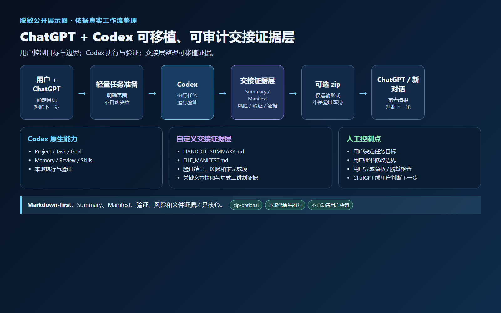
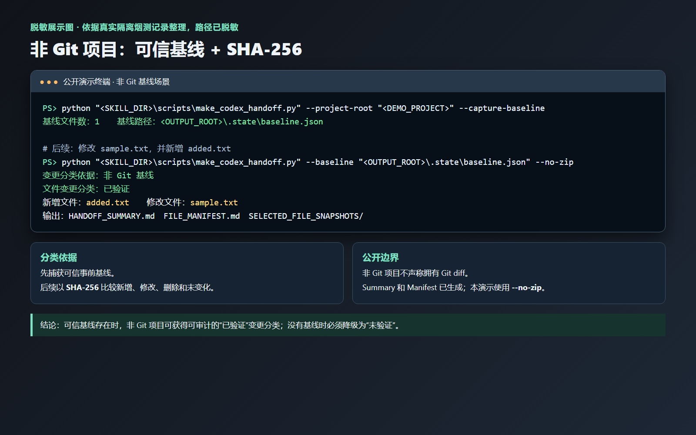
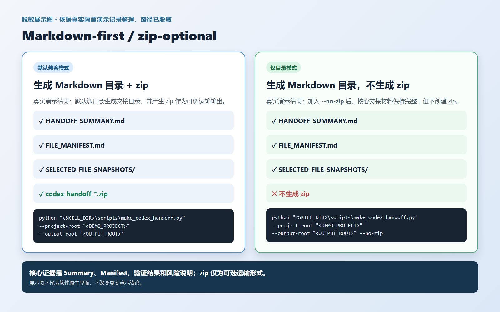

# ChatGPT + Codex 可移植、可审计交接证据层

## 项目定位

这是建立在 Codex 原生能力之上的交接证据层，使用 Markdown-first 的方式整理可移植、可审计的项目交接材料。

## 核心内容

- 默认以 `HANDOFF_SUMMARY.md`、`FILE_MANIFEST.md`、验证结果、风险和未完成项作为交接核心。
- 可选 zip 仅是运输格式；默认支持 `--no-zip`。
- 覆盖 Git 与非 Git 双场景；非 Git 场景使用基线与 SHA-256。
- Git 状态获取失败时安全降级为“未验证”。
- 二进制证据显式纳入清单。

## 已验证证据与边界

已记录 unittest 9 项通过、七类隔离烟测通过，以及三张公开脱敏展示图。本项目不自动替用户决策，也不替代 Codex 原生能力。

当前源代码和内部证据包暂未公开；如后续开源，应另建脱敏源代码仓库。本页不包含本机绝对路径、用户信息或内部封存包路径。

[返回作品集首页](../README.md)
