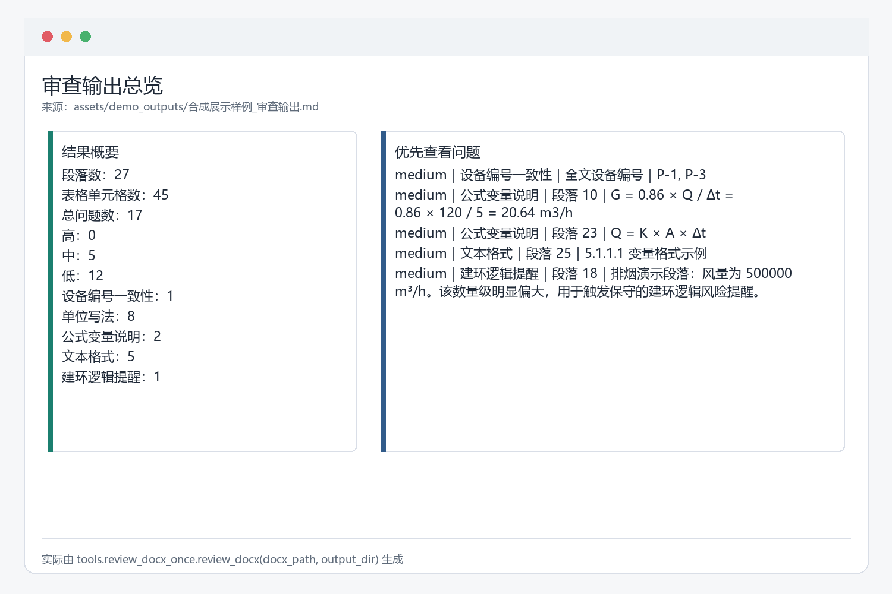
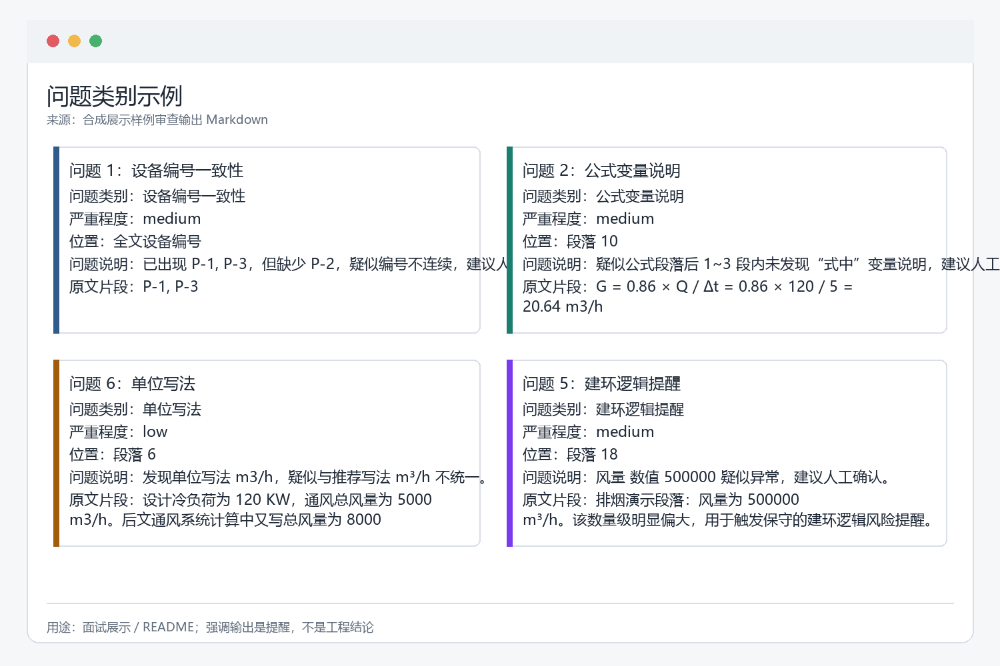
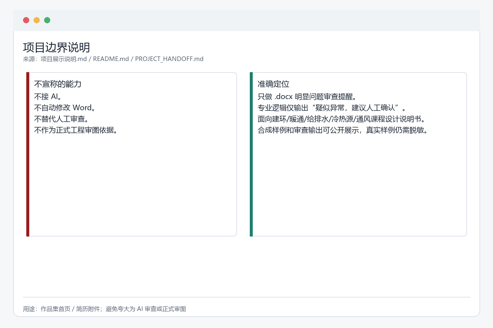

# 建环资料审查器

## 项目定位

面向建环课程设计说明书的 `.docx` 明显问题提醒工具，用于发现格式、单位、公式说明和专业逻辑风险。

## 公开演示与证据

项目使用公开合成样例，实际生成审查输出。当前展示记录包含 17 个提醒：medium 5 个、low 12 个；并提供 6 张已公开截图、pytest 与验收证据。

## 项目边界

- 不接入 AI。
- 不自动修改 Word。
- 不替代人工审查。
- 不作为正式工程审图依据。
- 不复制或展示真实学生课程设计文档。

当前源代码仓库暂未公开；本页只展示脱敏项目说明和截图。

[返回作品集首页](../README.md)
