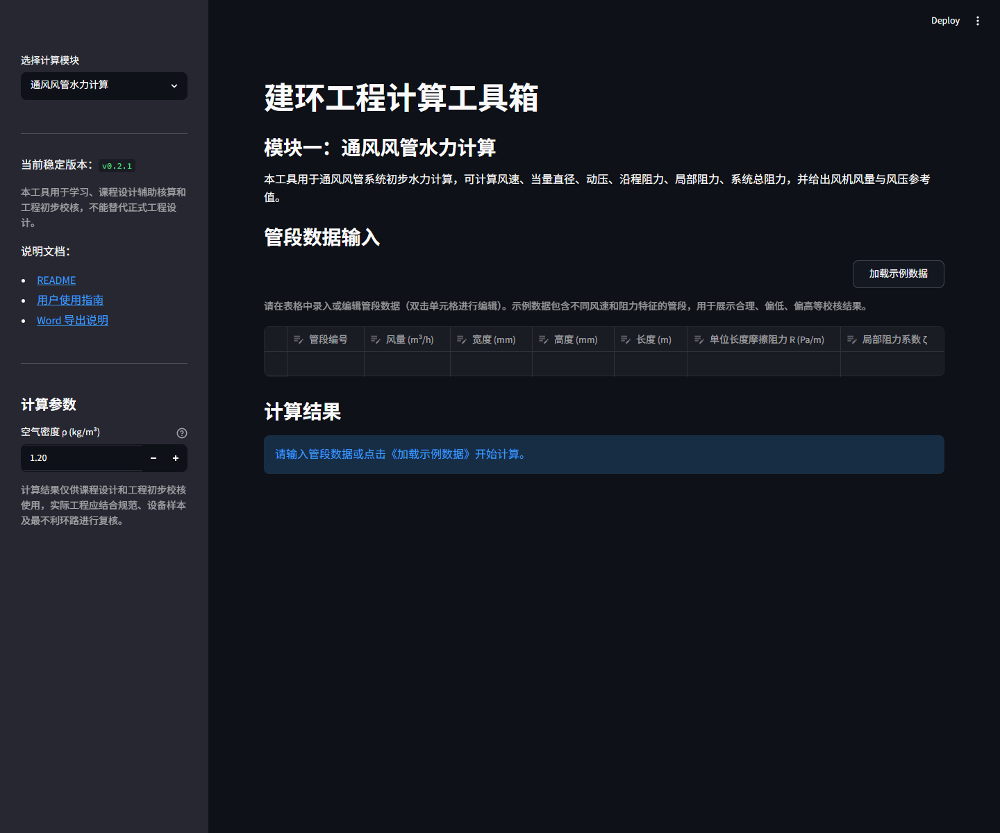
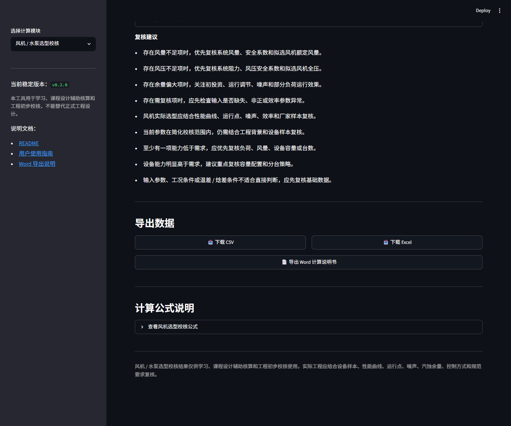

# 建环工程计算工具箱

## 项目定位

面向学习和课程设计辅助的建环工程计算工具箱，集中处理通风风管与空调水系统的水力计算。

## 使用场景与核心功能

- 通风风管水力计算：支持风速、当量直径、动压、沿程阻力、局部阻力和系统总阻力等计算结果查看。
- 空调水系统水力计算：支持水系统相关水力计算与结果整理。
- 结果导出：提供 CSV、Excel 和 Word 导出。
- 页面交互：以 Streamlit 页面提供输入、计算与结果查看流程。

## 分工与验证

本人负责需求、建环规则、验收和边界；AI 辅助编码、查错和文档整理。已验证的证据包括测试、CI 和 Release 记录；最新 Project Checks #24 已确认通过。

## 公开链接

- [GitHub 源码仓库](https://github.com/yishidezhangjie666-sys/hvac-duct-hydraulic-calculator)
- [Streamlit 应用](https://hvac-mep-calc-toolbox.streamlit.app/)

Streamlit 部署已确认可访问；应用可能因休眠需要先唤醒。

## 项目边界

本工具用于学习和课程设计辅助，不替代天正、鸿业、广联达等专业软件，也不作为正式工程审图依据。专业规则、验收与最终判断由本人负责。

[返回作品集首页](../README.md)
